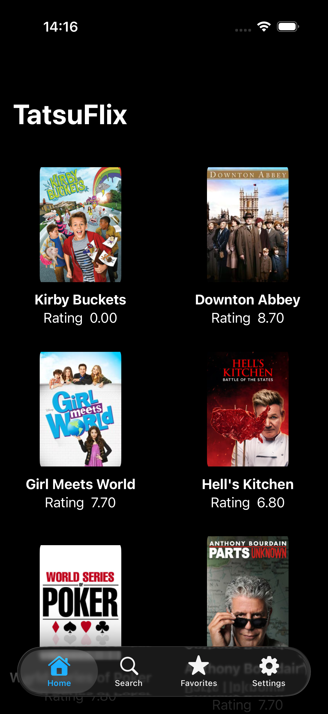
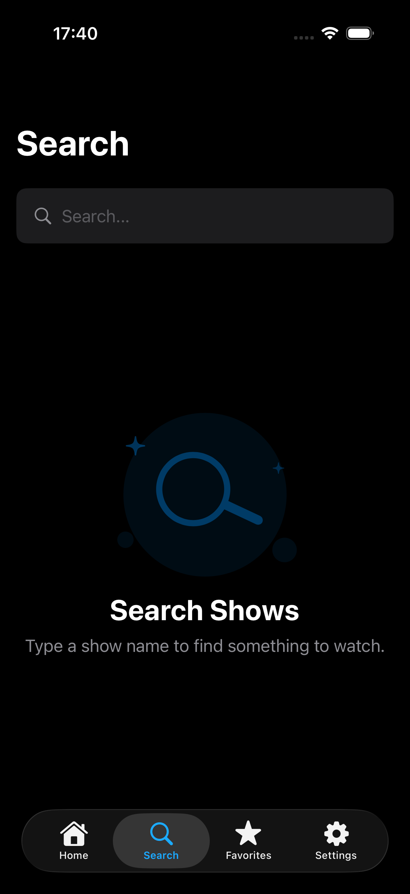
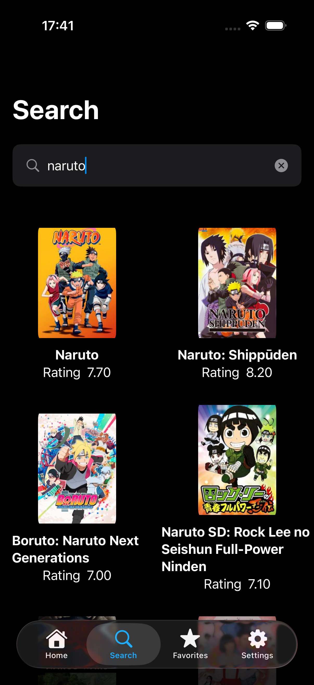
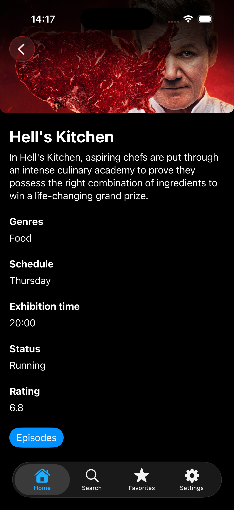
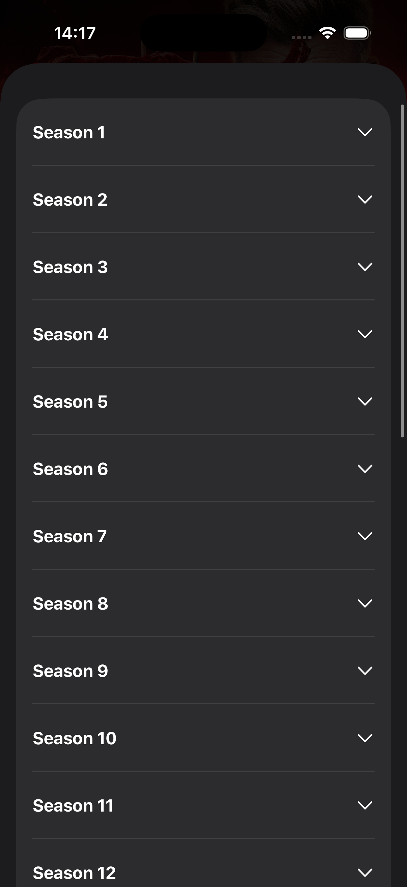
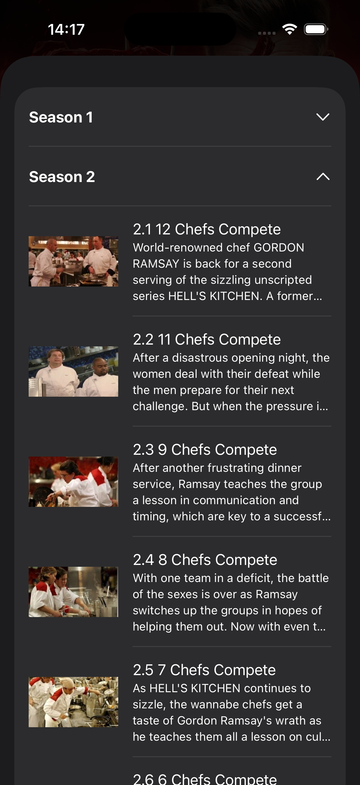
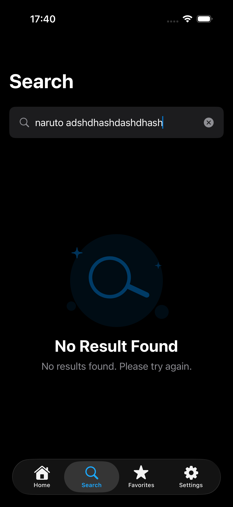
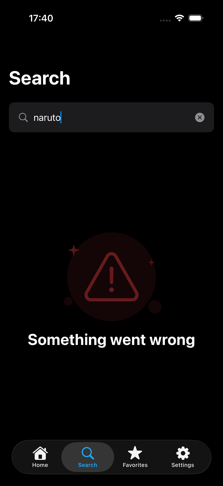

# TatsuFlix-MVI

TatsuFlix-MVI is an iOS app built with SwiftUI and The Composable Architecture. It consumes the TVMaze API to browse TV shows, open show details, and view episodes.

The project is focused on a unidirectional data-flow style: views render state, user interactions send actions, reducers mutate state and run effects, and networking is handled with Swift concurrency.

## Features

- Tab-based SwiftUI app shell with Home, Search, Favorites, and Settings sections.
- Home screen that fetches and lists shows.
- Search screen with debounced TV show lookup, loading, empty, error, and result states.
- Show details screen with a banner image, summary, genres, schedule, status, rating, and episode navigation.
- Episodes screen that fetches episodes, groups them by season, and displays collapsible season rows.
- Reusable UI components for async images, loading state, typography, and spacing tokens.
- Generic networking layer built around typed API requests.

## Screenshots

<p>
  
  
  
  
  
  
</p>

<p>
  
  
</p>

## Architecture

The app uses The Composable Architecture for feature state management.

Each feature is split into:

- `State`: the data needed to render the screen.
- `Action`: all user events, lifecycle events, and async responses the feature can handle.
- `Store`: a reducer that receives actions, mutates state, and returns effects.
- `View`: a SwiftUI view that observes store state and sends actions.

Examples:

- `HomeStore`, `HomeState`, and `HomeView`
- `SearchStore`, `SearchState`, and `SearchView`
- `ShowDetailsStore`, `ShowDetailsState`, and `ShowDetailsView`
- `EpisodesStore`, `EpisodesState`, and `EpisodesView`

Navigation is handled with a mix of SwiftUI navigation APIs and TCA navigation state. `HomeStore.Path` models navigation from Home into Show Details, `SearchStore.Path` models navigation from Search results into Show Details, and `ShowDetailsStore.Destination` presents Episodes from the details screen.

The app shell uses `AppTabView` and an observable `Router` to keep tab-specific navigation paths for Home, Search, Favorites, and Settings.

## SwiftUI

The UI is built with SwiftUI views and small reusable components:

- `AsyncImageView` wraps SwiftUI `AsyncImage` and supports configurable image sizing and content mode.
- `LoadingView` centralizes loading UI.
- `TextComponents` provides reusable text styles such as title, headline, body, and footnote text.
- `Tokens` centralizes spacing values.

## Async/Await Networking

Networking is implemented with Swift concurrency.

`NetworkClientProtocol` exposes:

```swift
func send<T: APIRequest>(_ request: T) async throws -> T.Response
```

`NetworkClient` uses `URLSession.shared.data(for:)` with `async/await`, validates HTTP status codes, decodes typed responses with `JSONDecoder`, and maps failures into `ApiError`.

Requests conform to `APIRequest`, which defines an associated `Response` type and an `Endpoint`. This keeps API calls strongly typed:

- `GetShowsRequest` returns `[ShowResponse]`
- `SearchShowsRequest` returns `[SearchSeriesResponse]`
- `EpisodesRequest` returns `[EpisodeResponse]`


## Getting Started

1. Open `TatsuFlix-MVI.xcodeproj` in Xcode.
2. Select the `TatsuFlix-MVI` scheme.
3. Build and run the app on a simulator or device.

The app currently fetches data from TVMaze over the network, so an internet connection is required.

## Pending Improvements

- Add localization for all user-facing strings.
- Add local favorites persistence with SwiftData.
- Implement the Favorites flow using persisted shows.
- Add Settings options such as theme, cache controls, and app information.
- Add unit tests for reducers, networking, request building, and episode grouping.
- Add functional tests for Home to Details to Episodes flows.
- Add snapshot tests for Home, Show Details, Episodes, loading, and error states.
- Add UI automation tests for tab navigation and collapsible episode sections.
- Improve API error presentation with retry actions and user-friendly messages.
- Add pagination/infinite scrolling on the Home screen.
- Add image caching or a dedicated image-loading strategy.
- Move hard-coded delays out of reducers or replace them with testable clock dependencies.
- Add dependency injection through TCA dependencies instead of storing services directly in reducers.
- Improve accessibility labels, Dynamic Type behavior, and VoiceOver navigation.
- Add empty states for screens with no content.
- Add offline/cache behavior for previously loaded shows and episodes.
- Add CI for build, tests, and formatting.
- Add linting/formatting rules.
